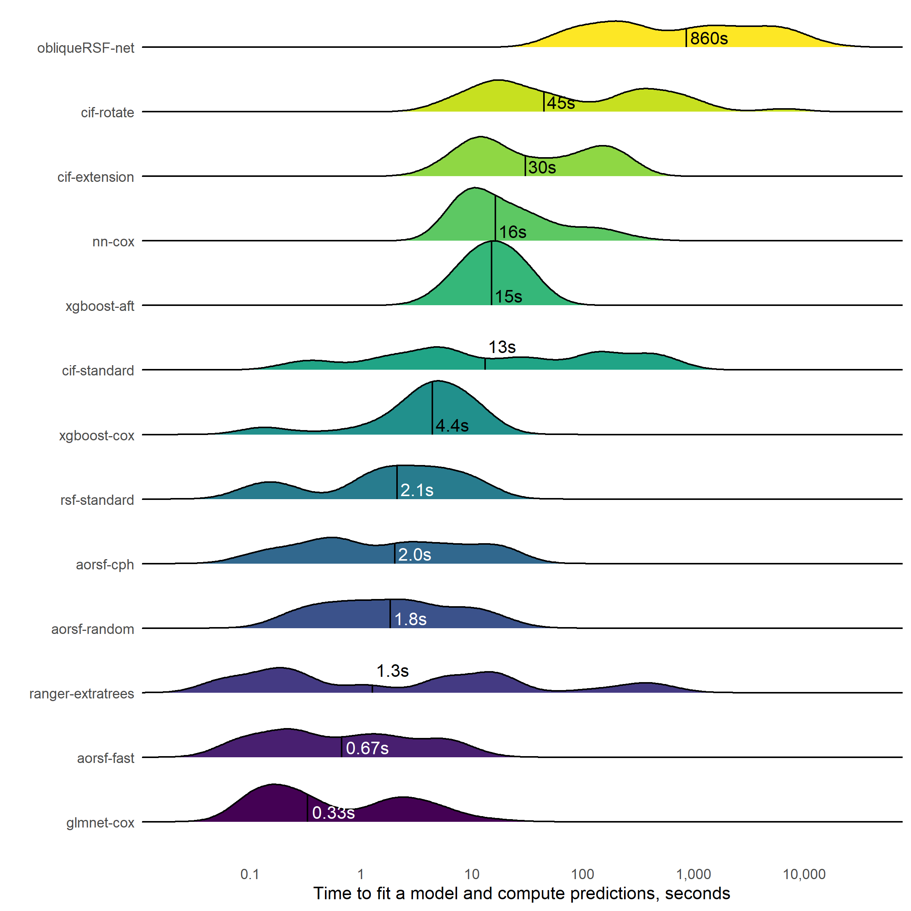
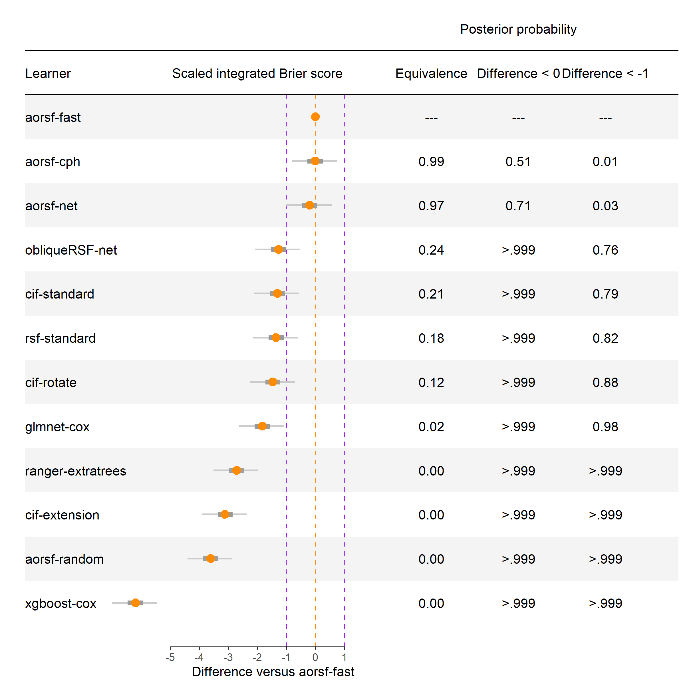
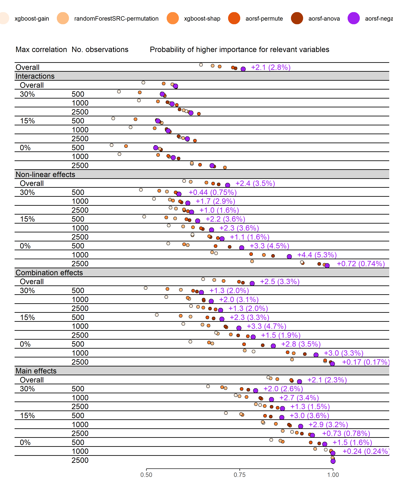

<!-- README.md is generated from README.Rmd. Please edit that file -->

# aorsf-bench

<!-- badges: start -->
<!-- badges: end -->

The goal of aorsf-bench is to introduce and evaluate

1.  a method to increase the computational efficiency of (i.e.,
    accelerate) the oblique random survival forest (RSF)
2.  a method to estimate importance of individual predictor variables
    with the oblique RSF.

The entire project is summarized in a paper: `paper/arxix/main.pdf`.

## tl;dr

In case you want a much quicker summary of the paper:

- We made oblique RSFs faster and also developed a new method to
  estimate importance of individual predictors with them. These methods
  are available in the `aorsf` R package.

- We find that the accelerated oblique RSF (`aorsf-fast` in the paper)
  is very fast. In fact, in a benchmark with 35 different risk
  prediction tasks, `aorsf-fast` was faster than all of the learners we
  analyzed, except for penalized Cox regression models (`glmnet-cox` in
  the paper). **Figure**: Distribution of time taken to fit a prediction
  model and compute predicted risk. The median time, in seconds, is
  printed and annotated for each learner by a vertical line.

<!-- -->

    #> Warning: Using the `size` aesthetic with geom_segment was deprecated in ggplot2 3.4.0.
    #> i Please use the `linewidth` aesthetic instead.
    #> This warning is displayed once every 8 hours.
    #> Call `lifecycle::last_lifecycle_warnings()` to see where this warning was
    #> generated.



- We find that `aorsf-fast` has the best index of prediction accuracy
  out of all the learners we evaluated: **Figure**: Expected differences
  in index of prediction accuracy between the accelerated oblique random
  survival forest and other learning algorithms. A region of practical
  equivalence is shown by purple dotted lines, and a boundary of
  non-zero difference is shown by an orange dotted line at the origin.



- We find that negation variable importance improves the chances of
  ranking a relevant variable as more important than an irrelevant
  variable when using an oblique RSF to estimate variable importance.
  **Figure**: Concordance statistic for assigning higher importance to
  relevant versus irrelevant variables. Text appears in rows where
  negation importance obtained the highest concordance, showing absolute
  and percent improvement over the second best technique.



## Reproducing this paper

We use `targets` to coordinate the general benchmark experiment and
simulation study that are presented in this research, and hope that our
use of `targets` also makes it easier for others to engage with our
code.

Our work can be reproduced, mostly. The only thing that can’t be
reproduced are the results based on datasets that we can’t share with
you. To replicate our work using publicly available data, you need to
edit the vector of datasets passed into our `targets` pipeline (see
`_targets.R`) so that it only contains publicly available data. Below is
a code chunk showing which datasets you need to comment out:

``` r

data_source = c(
  "veteran",
  "colon_recur",
  "colon_acm",
  "pbc_orsf",
  "time_to_million",
  "gbsg2",
  "peakV02",
  "flchain",
  "nafld",
  "rotterdam_recur",
  "rotterdam_acm",
  "actg_aids",
  "actg_death",
  # "guide_it_cvd",    
  # "guide_it_hfhosp", 
  "breast",
  # "sprint_cvd",
  # "sprint_acm",
  "nki",
  "lung",
  "lung_ncctg",
  "follic_death",
  "follic_relapse",
  "mgus2_death",
  "mgus2_pcm"
  # "mesa_hf",
  # "mesa_chd",
  # "mesa_stroke",
  # "mesa_death",
  # "aric_hf",
  # "aric_chd",
  # "aric_stroke",
  # "aric_death",
  # "jhs_stroke",
  # "jhs_chd"
)
```

You’ll still need to create the `nafld` data by running `nafld_build()`,
which is an R function included in `R/nafld_build.R` that combines
multiple datasets in the `survival` package into a dataset we analyzed
in the current study.

Once you’ve completed these steps and installed the packages listed in
`packages.R`, all you need to do is run `targets::tar_make()`. However,
it will take a very long time to make the pipeline as-is and I recommend
setting `run_seed` to be `1:3` (see `_targets.R` to modify this value)
to request only 3 replications of Monte-Carlo cross validation be
completed. Also, you are free to use only a subset of the learners by
commenting out the ones you don’t want to run. Here is what I’d
recommend if you’d like to speed up the pipeline:

``` r

# slower model fitters are commented out

model_fitters <- c(
  'aorsf_fast',
  'aorsf_cph',
  # 'aorsf_random',
  # 'aorsf_net',
  # 'rotsf',
  # 'rsfse',
  # 'cif',
  'cox_net',
  # 'coxtime',
  # 'obliqueRSF',
  'xgb_cox',
  # 'xgb_aft',
  'randomForestSRC',
  'ranger'
)
```
